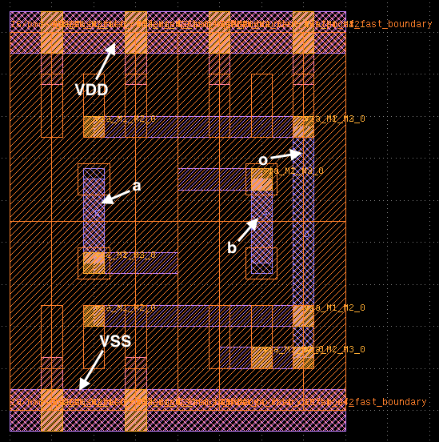

# LAYGO - LAYout with Gridded Objects 

Laygo is an add-on to [BAG2](https://github.com/pkerichang/BAG_framework)
framework for layout generation, written by
[Jaeduk Han](jdhan@eecs.berkeley.edu) and licensed under the BSD license.
With laygo, primitive layout parameters are abstracted as templates and
grids, and the layout job can be done without dealing with complex
design rules.
Layout process is abstracted and scripted in python, and with the help
of BAG API, laygo provides higher productivity and process portability
than conventional custom IC design flows.


## Installation and Quick Start
1. Install BAG2 (not necessary if the GDS flow is used)
2. Clone laygo repo
    ```
    $ git clone git@github.com:ucb-art/laygo.git
    ```
3. Prepare following technology setup files.
    * **laygo_config.yaml** - contains general technology information.
     Example can be found here:
     [labs/laygo_config.yaml](./labs/laygo_config.yaml)
    * **(technology_name).layermap** - layer mapping file for the GDS flow.
     Usually this file can be found in your PDK library.
     If the BAG flow is used, this file is not required.
     Example can be found here:
     [labs/laygo_faketech.layermap](./labs/laygo_faketech.layermap)
    * **primitive template and grid database** : laygo keeps template and
     grid information in yaml files. Files can be provided under NDA or
     constructed by users from handcrafted or generated GDS/OA.
     Examples can be found here:
     [labs/laygo_faketech_microtemplates_dense_templates.yaml](./labs/laygo_faketech_microtemplates_dense_templates.yaml),
     [labs/laygo_faketech_microtemplates_dense_grids.yaml](./labs/laygo_faketech_microtemplates_dense_grids.yaml)

    Those files can be provided to BWRC users (under proper NDA), as a
    form of git repository. Laygo has default technology setup files for
    the GDS flow (laygo_faketech).
4. Launch ipython and run the tutorial script
    [quick_start_GDS.py](./quick_start_GDS.py).
    ```
    $ start_bag.sh    (or ipython)
    > cd laygo
    > run quick_start_GDS.py
    ```
    It will create a nand gate layout and save it to output.gds.

    

    [KLayout](http://www.klayout.de/) was used for gds display. Detailed
    explaination on tutorials can be found here:

5. Go over lab materials in [labs/](./labs/). Detailed instructions
can be found in [lab readme](docs/labs.md).

## Documentations
You can find detailed documentations on the laygo API here:
[docs/build_html/index.html](docs/build_html/index.html)
(Open it after cloning the repo the get the correct page layout.)

## Example Labs
Various lab modules are provided to guide the layout generation
procedure. Users are strongly recommended to finish all lab modules
before working on their designs. Labs modules can be found [here](docs/build_html/labs.html)

## Example Generators
Example generaters can be found [here](docs/build_html/generators.html).

## License
This project is licensed under the BSD License - check the
[LICENSE](LICENSE) file for details.
