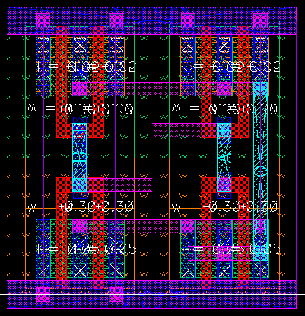

# NAND gate generation and BAG export tutorial

This tutorial contains instructions to generate a NAND gate layout and
export it to OA database through
[BAG](https://github.com/pkerichang/BAG_framework) framework. You can
simply run this tutorial by setting up BAG for
[freePDK45 technology](https://github.com/ucb-art/BAG2_freePDK45) or
[cadence generic PDK for finfet and multi patterned technology](https://support.cadence.com)
and running [quick_start_BAG.py](../../../quick_start_BAG.py), but we
recommend users to go through the entire tutorial steps, reading this
document and running commands step by step, to get a better idea of the
laygo flow.

## Setup and running
Run following commands below to install laygo and load.

1. Download freePDK45 PDK from https://www.eda.ncsu.edu/wiki/FreePDK45:Contents
Make sure you can launch virtuoso and make a layout using the PDK.
For BWRC users, freePDK45 is installed in
```/tools/projects/eeis/BAG_2.0/pdk_files/freePDK45/NCSU-FreePDK45-1.4/```
and all configurations are set to point the path.

    * For cadence generic PDK, you can get the PDK file from
    [Cadence support](https://support.cadence.com). For BWRC users,
    PDK is installed in ```/tools/cadence/GPDK/cds_ff_mpt_v_0.3/```.

2. Clone BAG2_freePDK45 repo.

    ```
    $ git clone git@github.com:ucb-art/BAG2_freePDK45.git
    ```

    * For cadence generic PDK, close BAG2_cds_ff_mpt repo.
    ```
    $ git clone git@github.com:ucb-art/BAG2_cds_ff_mpt.git
    ```


3. The technology setup repo has 2 submodules in it: BAG_framework and
laygo. Let's update the submodules. Move into the BAG_freePDK45
(or BAG2_cds_ff_mpt) directory and type this:

    ```
    $ git submodule init
    $ git submodule update
    $ git submodule foreach git pull origin master
    ```

4. Open **.cshrc**, **bag_config.yaml** file, and check if all path
variables are set correctly. For BWRC users, all variables are set
correctly so skip this step.

5. Source .cshrc, launch virtuoso. Check if you can see all libraries
listed below.

    

    type ```load "start_bag.il"``` in CIW to load skill APIs for bag.

6. Launch bag, by typing this:

    ```
    $ start_bag.sh
    ```

7. Launch the generator script, by typing this in python console.

    ```python
    run laygo/quick_start_BAG.py
    ```

    You should see the generated nand gate layout in
    laygo_working/nand_test, which looks like this.

    

    For cds_ff_mpt technology, the layout should look like this.

    

## Initialize GridLayoutGenerator
Let's take a look into the detail of generater to get a better
understanding on it. Open laygo/quick_start_BAG.py
Following commands to initialize GridLayoutGenerator, the main
generator object that contains all template and grid based layout
generation functions.

```python
#initialize
laygen = laygo.GridLayoutGenerator(config_file="./labs/laygo_config.yaml")
```

## Load template and grid database
The provide technology setup uses *laygo_faketech_microtemplates_dense*
for primitive template library name. All primitive template and grid
information are stored in [freePDK45_microtemplates_dense_templates.yaml](freePDK45_microtemplates_dense_templates.yaml),
[freePDK45_microtemplates_dense_grids.yaml](freePDK45_microtemplates_dense_grids.yaml)
and the files need to be loaded before actual layout generation steps.
Run following commands for the database loading.

```python
#template and grid load
utemplib = 'freePDK45_microtemplates_dense' #device template library name
laygen.load_template(filename=utemplib+'_templates.yaml', libname=utemplib)
laygen.load_grid(filename=utemplib+'_grids.yaml', libname=utemplib)
laygen.templates.sel_library(utemplib)
laygen.grids.sel_library(utemplib)
```

**load_template** and **load_grid** functions load yaml files that store
template and grid database to laygen.templates and laygen.grid.
If you want to see the loaded information, run the following commands.

```
laygen.templates.display()
laygen.grids.display()
```

Or you can specify template (or grid name) to display, like this.

```python
laygen.templates.display(libname='freePDK45_microtemplates_dense', templatename='nmos4_fast_center_nf2')
laygen.grids.display(libname='freePDK45_microtemplates_dense', gridname='route_M1_M2_basic')
```

Then you can see the specified template and grid information, as shown
below.

```
Display lib:freePDK45_microtemplates_dense, template:nmos4_fast_center_nf2
[Library]freePDK45_microtemplates_dense
 [Template]nmos4_fast_center_nf2
 xy:[[0.0, 0.0], [0.4, 0.9]] pins:{'S0': {'netname': 'S0', 'layer': ['M1', 'pin'], 'xy': array([[-0.05,  0.2 ],
       [ 0.05,  0.5 ]])}, 'S1': {'netname': 'S1', 'layer': ['M1', 'pin'], 'xy': array([[ 0.35,  0.2 ],
       [ 0.45,  0.5 ]])}, 'D0': {'netname': 'D0', 'layer': ['M1', 'pin'], 'xy': array([[ 0.15,  0.2 ],
       [ 0.25,  0.5 ]])}, 'G0': {'netname': 'G0', 'layer': ['M1', 'pin'], 'xy': array([[ 0.125,  0.625],
       [ 0.275,  0.775]])}}
Display lib:freePDK45_microtemplates_dense, grid:route_M1_M2_basic
[Library]freePDK45_microtemplates_dense
 [Grid]route_M1_M2_basic
  route_M1_M2_basic width:0.2 height:0.2 xgrid:[ 0.] ygrid:[ 0.] xwidth:[ 0.1] ywidth:[ 0.1] viamap:{via_M1_M2_0: [0, 0] }
```

## Library and cell creation
After initializing laygo and loading templates and grids, the next step
is creating a library and cell to work on. Run the following commands to
make a nand gate cell.

```python
# library creation
laygen.add_library('laygo_working')
# cell generation
laygen.add_cell('nand_test')
```

The commands will create library and cell to work on. In order to
display the contents, simply type ```laygen.display()```. The laygen
will show following contents (The nand_test is empty because we did not
create anything yet).

```
Display
[Library]laygo_working
 [Cell]nand_test
```

## Cell placements
Following commands will place 4 2-fingered transistors (2 nmos, 2 pmos)
and cluster them to 2 lists, nrow and prow. Try running these commands
first.

```python
nrow=[]
nrow+=[laygen.relplace(name=None, templatename='nmos4_fast_boundary', gridname='placement_basic', xy=[0, 0])]
nrow+=[laygen.relplace(name=None, templatename='nmos4_fast_center_nf2', gridname='placement_basic', refinstname=nrow[0].name)]
nrow+=[laygen.relplace(name=None, templatename='nmos4_fast_boundary', gridname='placement_basic', refinstname=nrow[1].name)]
nrow+=[laygen.relplace(name=None, templatename='nmos4_fast_boundary', gridname='placement_basic', refinstname=nrow[2].name)]
nrow+=[laygen.relplace(name=None, templatename='nmos4_fast_center_nf2', gridname='placement_basic', refinstname=nrow[3].name)]
nrow+=[laygen.relplace(name=None, templatename='nmos4_fast_boundary', gridname='placement_basic', refinstname=nrow[4].name)]
prow=[]
prow+=[laygen.relplace(name=None, templatename='pmos4_fast_boundary', gridname='placement_basic', refinstname=nrow[0].name, direction='top', transform='MX')]
prow+=[laygen.relplace(name=None, templatename='pmos4_fast_center_nf2', gridname='placement_basic', refinstname=prow[0].name, transform='MX')]
prow+=[laygen.relplace(name=None, templatename='pmos4_fast_boundary', gridname='placement_basic', refinstname=prow[1].name, transform='MX')]
prow+=[laygen.relplace(name=None, templatename='pmos4_fast_boundary', gridname='placement_basic', refinstname=prow[2].name, transform='MX')]
prow+=[laygen.relplace(name=None, templatename='pmos4_fast_center_nf2', gridname='placement_basic', refinstname=prow[3].name, transform='MX')]
prow+=[laygen.relplace(name=None, templatename='pmos4_fast_boundary', gridname='placement_basic', refinstname=prow[4].name, transform='MX')]
```

**GridLayoutGenerator.replace** function places templates on grid,
using relative geometry information provided as arguments. Basically
there are 2 major ways to place using:

1. **xy**: with **xy** argument, the function places the
template (specified by templatename) at **xy** on grid, specified by
gridname.
2. **refinstname**: with refinstname argument, the function places
the template (specified by templatename) on grid, specified by
gridname, bound from **refinstname**, with additional geometry
information such as **direction** and **transform**.

The way to architect template totally depends on user's interests,
for the example technology, **nmos4_fast_center_nf2** and
**pmos4_fast_center_nf2** templates are 2-fingered NMOS/PMOS devices, and
**nmos4_fast_boundary** and **pmos4_fast_boundary** templates are used for
boundary geometries for NMOS/PMOS devices.

The resulting layout placement should look like this.


If you want to display the layout, run the following command and open
**laygo/nand_test**. Note that actual NMOS/PMOS shapes are not shown
because they are abstracted.

```python
laygen.export_BAG(prj)
```

Instead of the single cell placements, multiple cells can be placed by
single **relplace** function with list arguments, like this:

```python
nrow = laygen.relplace(name=None, templatename=['nmos4_fast_boundary', 'nmos4_fast_center_nf2', 'nmos4_fast_boundary',
                                                'nmos4_fast_boundary', 'nmos4_fast_center_nf2', 'nmos4_fast_boundary'],
                       gridname='placement_basic')
prow = laygen.relplace(name=None, templatename=['pmos4_fast_boundary', 'pmos4_fast_center_nf2', 'pmos4_fast_boundary',
                                                'pmos4_fast_boundary', 'pmos4_fast_center_nf2', 'pmos4_fast_boundary'],
                       gridname='placement_basic', refinstname=nrow[0].name, direction=['top']+['left']*6, transform='MX')
```

## Signal routing
Routing can be done by calling **route** commands. This routine creates
a 180-degree rotated L shaped route, stacked from M1 to M3, for one of
the nand gate input.

```python
#a
laygen.route(None, xy0=[0, 0], xy1=[0, 0], gridname0=rg_m1m2, refinstname0=prow[4].name, refpinname0='G0',
             via0=[[0, 0]], refinstname1=nrow[4].name, refpinname1='G0')
laygen.route(None, xy0=[-2, 0], xy1=[0, 0], gridname0=rg_m1m2, refinstname0=prow[4].name, refpinname0='G0',
             refinstname1=prow[4].name, refpinname1='G0')
ra0 = laygen.route(None, xy0=[0, 0], xy1=[0, 2], gridname0=rg_m2m3,refinstname0=prow[4].name, refpinname0='G0',
                   refinstname1=prow[4].name, refpinname1='G0', via0=[[0, 0]], endstyle0="extend", endstyle1="extend")
```

The generated routing pattern should look like this (if you run
**export_BAG**):


Note that **refinstname** and **refpinname** are used to describe instance
and pin related geometries for the routing, and **via0** and **via1**
parameters are used to place via abut to the route objects.

Running following commands will generate wire connections.

```python
# b
laygen.route(None, xy0=[0, 0], xy1=[0, 0], gridname0=rg_m1m2, refinstname0=nrow[1].name, refpinname0='G0',
             via0=[[0, 0]], refinstname1=prow[1].name, refpinname1='G0')
laygen.route(None, xy0=np.array([0, 0]), xy1=[2, 0], gridname0=rg_m1m2, refinstname0=nrow[1].name, refpinname0='G0',
             refinstname1=nrow[1].name, refpinname1='G0')
rb0 = laygen.route(None, xy0=[0, 0], xy1=[0, 2], gridname0=rg_m2m3,refinstname0=nrow[1].name, refpinname0='G0',
                   refinstname1=nrow[1].name, refpinname1='G0', via0=[[0, 0]], endstyle0="extend", endstyle1="extend")
#internal connections
laygen.route(None, xy0=[0, 1], xy1=[0, 1], gridname0=rg_m1m2, refinstname0=nrow[1].name, refpinname0='D0',
             refinstname1=nrow[4].name, refpinname1='S1', via0=[[0, 0]], via1=[[-2, 0], [0, 0]])
#output
laygen.route(None, xy0=[0, 1], xy1=[1, 1], gridname0=rg_m1m2, refinstname0=prow[1].name, refpinname0='D0',
             refinstname1=prow[4].name, refpinname1='D0', via0=[[0, 0]], via1=[[-1, 0]])
laygen.route(None, xy0=[-1, 0], xy1=[1, 0], gridname0=rg_m1m2, refinstname0=nrow[4].name, refpinname0='D0',
             refinstname1=nrow[4].name, refpinname1='D0', via0=[[1, 0]])
ro0 = laygen.route(None, xy0=[1, 0], xy1=[1, 1], gridname0=rg_m2m3,refinstname0=nrow[4].name, refpinname0='D0',
                   via0=[[0, 0]], refinstname1=prow[4].name, refpinname1='D0', via1=[[0, 0]])
```


## Power routing
Power routing is very similar to signal routing. Run following commands
to creat power rail shapes.

```python
# power and ground vertical route
for s in ['S0', 'S1']:
    xy_s0 = laygen.get_template_pin_coord(nrow[1].cellname, s, rg_m1m2)[0, :]
    laygen.route(None, xy0=xy_s0 * np.array([1, 0]), xy1=xy_s0, gridname0=rg_m1m2,
                 refinstname0=nrow[1].name, via0=[[0, 0]], refinstname1=nrow[1].name)
    laygen.route(None, xy0=xy_s0 * np.array([1, 0]), xy1=xy_s0, gridname0=rg_m1m2,
                 refinstname0=prow[1].name, via0=[[0, 0]], refinstname1=prow[1].name)
    laygen.route(None, xy0=xy_s0 * np.array([1, 0]), xy1=xy_s0, gridname0=rg_m1m2,
                 refinstname0=prow[4].name, via0=[[0, 0]], refinstname1=prow[4].name)
# power and ground rails
xy = laygen.get_template_size(nrow[5].cellname, rg_m1m2) * np.array([1, 0])
rvdd=laygen.route(None, xy0=[0, 0], xy1=xy, gridname0=rg_m1m2, refinstname0=prow[0].name, refinstname1=prow[5].name)
rvss=laygen.route(None, xy0=[0, 0], xy1=xy, gridname0=rg_m1m2, refinstname0=nrow[0].name, refinstname1=nrow[5].name)
```

## Pin creation
**GridLayoutGenerator.pin** function creates a pin and paste it to the
generated layout. The function gets xy as arguments for pin coordinates,
possibly provided from calling **get_rect_xy** function and providing the
rect object that you want to create the pin over as an argument. Run the
 following commands.

```python
# pins
laygen.pin(name='A', layer=laygen.layers['pin'][3], xy=laygen.get_rect_xy(ra0.name, rg_m2m3), gridname=rg_m2m3)
laygen.pin(name='B', layer=laygen.layers['pin'][3], xy=laygen.get_rect_xy(rb0.name, rg_m2m3), gridname=rg_m2m3)
laygen.pin(name='O', layer=laygen.layers['pin'][3], xy=laygen.get_rect_xy(ro0.name, rg_m2m3), gridname=rg_m2m3)
laygen.pin(name='VDD', layer=laygen.layers['pin'][1], xy=laygen.get_rect_xy(rvdd.name, rg_m1m2), gridname=rg_m1m2)
laygen.pin(name='VSS', layer=laygen.layers['pin'][1], xy=laygen.get_rect_xy(rvss.name, rg_m1m2), gridname=rg_m1m2)
```

## Export to BAG
Running the following command will give a final layout exported in GDS
format.

```
# GDS export
laygen.export_BAG(prj)
```

The resulting layout will look like this.


